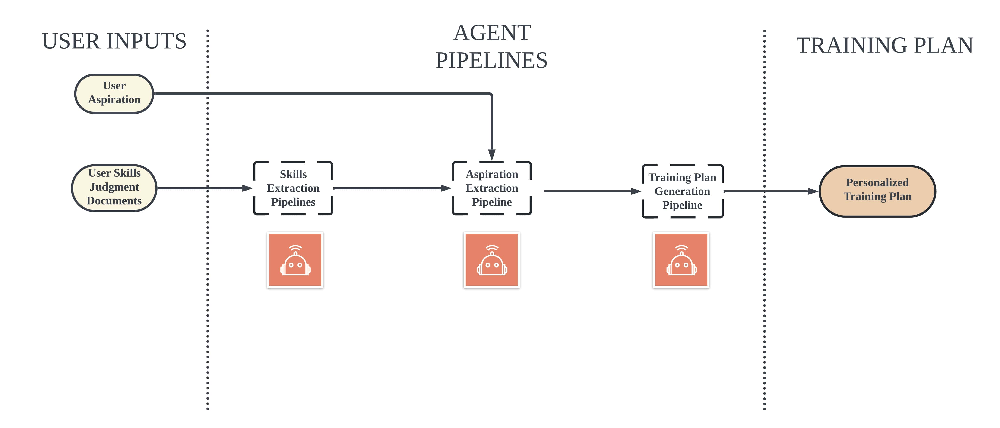
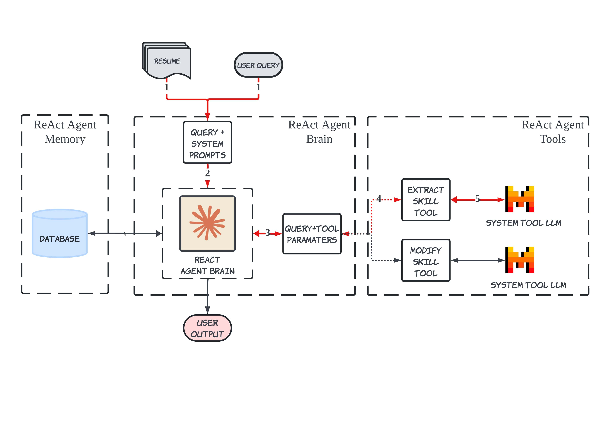
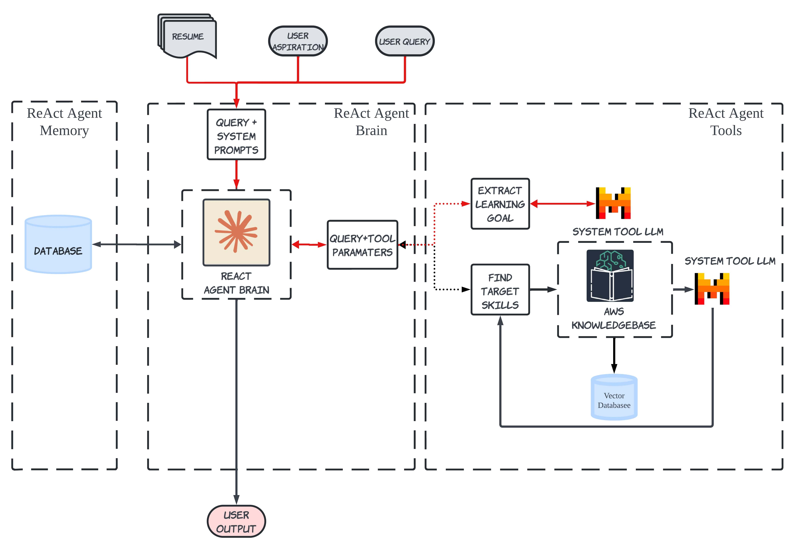
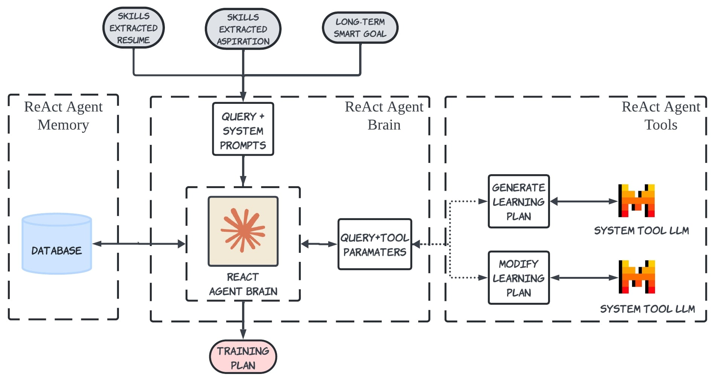

# TPRS 🤖

## Overview 💬
TPRS is a sophisticated system designed to enhance career development by extracting skills from users' resumes and aspirations, defining SMART goals, and recommending tailored training plans. Leveraging advanced multi-stage LLM ReAct agents, TPRS provides a comprehensive approach to skill development and goal achievement.

## Key Features ✴️ 
**Skill Extraction**: Automatically extracts skills from users' resumes.
**SMART Goal Extraction**: Identifies SMART goals from user aspirations.
**Training Plan Recommendation**: Suggests a personalized training plan to achieve the defined SMART goals.
**Natural Language Modification through ChatBot**: Allows users to edit the training plan, aspirations, and skills using a chatbot interface.

## Technologies Used 💻
- **Programming Languages & Frameworks****: Python, Flask, Streamlit
- **Large Language Models: Claude-3-Haiku**, Mistral 8x7B
- **Libraries**: LangChain, LangGraph ReAct Agents
- **Cloud Services**: AWS Bedrock (Prompt Management System, KnowledgeBase for RAG), AWS S3

# Architecture 📊

## Overall Architecture


## Skills Extraction Agent Architecture


## SMART Goal Extraction Agent Architecture


## Training Plan Recommendation Agent Architecture



# Product Demonstration 📺
- [Product Demonstration](https://youtu.be/adcW2zu7fB4)

# Installation ⬇️
-  Install the required packages by running the following command:
```bash
pip install -r requirements.txt
```
- Run the following command to start backend server:
```bash
python backend.py
```
- Run the following command to start frontend server:
```bash
streamlit run frontend.py
```
Note: AWS Bedrock credentials are required for full functionality.

# Usage
- Open the frontend server.
- Enter your resume and aspirations.
- Click the submit button to receive your personalized training plan recommendation.


